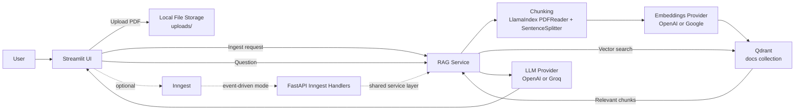
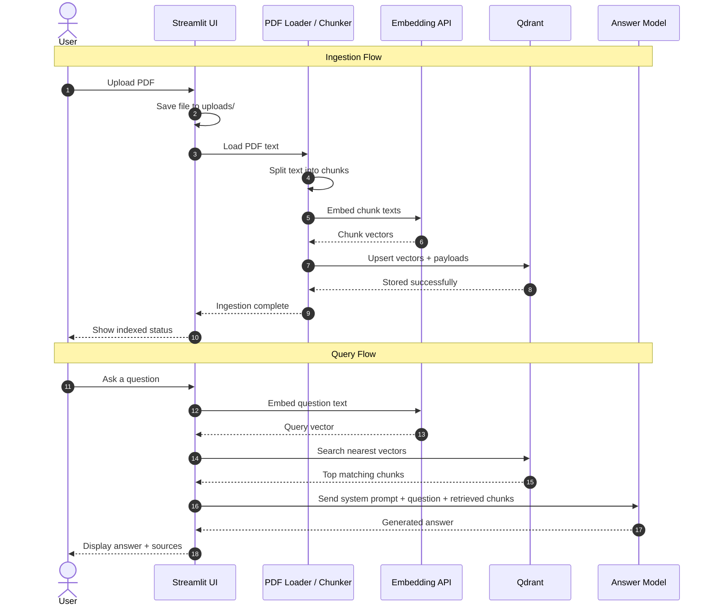

# Don't Make Me Read

Local PDF RAG application for uploading documents, indexing them into Qdrant, and querying them through a lightweight Streamlit interface.

The application supports:

- PDF ingestion and chunking
- vector storage in Qdrant
- retrieval-augmented question answering
- provider-based model configuration
- direct local execution with optional Inngest orchestration

## Architecture



## Sequence Diagram



## Overview

The repository is structured around a small shared service layer:

- `rag_service.py` owns ingestion, retrieval, and answer generation
- `streamlit_app.py` provides the local UI
- `main.py` exposes the same operations through Inngest-backed FastAPI handlers
- `vector_db.py` wraps Qdrant collection creation, indexing, and retrieval
- `data_loader.py` handles PDF loading, chunking, and embeddings
- `provider_config.py` centralizes provider and model configuration

The default operating mode is direct local execution. In this mode, Streamlit calls the RAG service directly and no Inngest runtime is required.

## Features

- Direct local PDF ingestion through Streamlit
- Question answering over indexed PDF content
- Configurable LLM provider:
  - OpenAI
  - Groq
- Configurable embedding provider:
  - OpenAI
  - Google Gemini embeddings
- Indexed file inventory in the UI with per-document chunk counts
- Duplicate-ingestion protection by document source name
- Optional Inngest-based event workflow for ingestion and query execution

## Processing Flow

### Ingestion

1. A PDF is uploaded through the Streamlit UI.
2. The file is written to `uploads/`.
3. `PDFReader` extracts text from the document.
4. `SentenceSplitter` breaks the text into chunks.
5. Chunks are embedded with the configured embedding provider.
6. Chunk vectors and payloads are upserted into the Qdrant `docs` collection.

Each stored point includes:

- `source`: the uploaded file name
- `text`: the chunk text

Chunk IDs are deterministic UUIDv5 values derived from the source name and chunk index.

### Query

1. A user submits a question through the UI.
2. The question is embedded with the same embedding provider used for retrieval.
3. Qdrant returns the top matching chunks.
4. The selected chunks are assembled into a context block.
5. The configured LLM provider generates the final answer.

## Runtime Modes

### Direct Mode

Direct mode is the primary local development path. Streamlit invokes the RAG service directly.

```env
USE_INNGEST=false
```

### Inngest Mode

Inngest mode routes ingestion and query execution through FastAPI-hosted Inngest functions. This mode is useful when validating event-driven behavior, rate controls, or workflow visibility.

```env
USE_INNGEST=true
```

## Requirements

- Python `>=3.13`
- Qdrant running on `http://localhost:6333`
- API credentials for the configured providers

Declared dependencies are managed in `pyproject.toml`.

## Installation

### Using `uv`

```bash
uv sync
```

### Using `pip`

```bash
python3 -m venv .venv
source .venv/bin/activate
pip install -e .
```

## Configuration

The repository includes a `.env.example` file describing the supported configuration surface.

### Core Application Settings

```env
USE_INNGEST=false
INNGEST_DEV=1
INNGEST_API_BASE=http://127.0.0.1:8288/v1
EMBEDDING_DIM=3072
```

### LLM Provider Settings

#### OpenAI

```env
LLM_PROVIDER=openai
OPENAI_API_KEY=...
OPENAI_LLM_MODEL=gpt-4o-mini
```

#### Groq

```env
LLM_PROVIDER=groq
GROQ_API_KEY=...
GROQ_LLM_MODEL=llama-3.3-70b-versatile
GROQ_BASE_URL=https://api.groq.com/openai/v1
```

### Embedding Provider Settings

#### OpenAI

```env
EMBEDDING_PROVIDER=openai
OPENAI_API_KEY=...
OPENAI_EMBEDDING_MODEL=text-embedding-3-large
```

#### Google Gemini Embeddings

```env
EMBEDDING_PROVIDER=google
GEMINI_API_KEY=...
GOOGLE_EMBEDDING_MODEL=gemini-embedding-001
GOOGLE_API_BASE=https://generativelanguage.googleapis.com/v1beta
GOOGLE_EMBED_BATCH_SIZE=8
GOOGLE_EMBED_DELAY_SECONDS=1.0
GOOGLE_EMBED_MAX_RETRIES=8
```

## Running the Application

### 1. Start Qdrant

```bash
docker run -p 6333:6333 qdrant/qdrant
```

### 2. Start the Streamlit UI

```bash
python3 -m streamlit run streamlit_app.py
```

The default UI is available at `http://localhost:8501`.

### 3. Optional: Start Inngest Mode

FastAPI application:

```bash
python3 -m uvicorn main:app --reload --port 8000
```

Inngest development server:

```bash
inngest dev -u http://localhost:8000/api/inngest
```

## Persistence

Two persistence mechanisms are used during local execution:

- Uploaded source files are stored in `uploads/`
- Indexed vectors and payloads are stored in the Qdrant `docs` collection

The Streamlit UI displays:

- uploaded file names
- whether each file is indexed
- chunk count per file
- total indexed chunk count

This makes it possible to verify persisted state after restarting the UI.

## Project Structure

```text
.
├── data_loader.py
├── main.py
├── provider_config.py
├── rag_service.py
├── streamlit_app.py
├── vector_db.py
├── custom_types.py
├── pyproject.toml
└── .env.example
```

## Implementation Notes

- Qdrant collection name defaults to `docs`
- Qdrant vector size is derived from `EMBEDDING_DIM`
- Streamlit avoids duplicate ingestion for already indexed files
- Google embedding requests include retry and pacing controls to reduce rate-limit pressure
- Groq is supported for generation only; embeddings are handled by OpenAI or Google

## Current Limitations

- No authentication or authorization layer
- No per-user document isolation
- No document deletion or re-index management workflow
- No metadata filtering during retrieval
- No automated evaluation pipeline
- No test suite in the current repository

## Development Notes

- `.env`, `uploads/`, `.venv/`, and `qdrant_storage/` are local-only artifacts and are excluded from version control
- The repository assumes a local Qdrant instance unless `vector_db.py` is extended for remote deployment
- The direct Streamlit execution path is the simplest way to validate ingestion and retrieval end-to-end
